# Demonstrate aplication deployment throught RHACM

Demo showing the 2 possible ways (at the time of writing this) to deploy GitOps based applications thanks to Red Hat Advanced Cluster Management For Kubernetes (from now on, `ACM`).

1. [Managing apps with Git repositories](https://access.redhat.com/documentation/en-us/red_hat_advanced_cluster_management_for_kubernetes/2.4/html-single/applications/index#managing-apps-with-git-repositories): deploy resources from `Git` repositories using ACM web console built in mechanism.

2. [Configuring Managed Clusters for OpenShift GitOps operator and Argo CD](https://access.redhat.com/documentation/en-us/red_hat_advanced_cluster_management_for_kubernetes/2.4/html-single/applications/index#gitops-config): registering a set of one or more ACM managed clusters to an instance of `Argo CD` an finally, deploying the application to those clusters.

>  **INFO**: base in Red Hat Advanced Cluster Management for Kubernetes 2.4 and OpenShift GitOps 1.5.2 (from now on, `Argo CD`).

## Tool Requirements

- OpenShift CLI Version >= 4.3.0 (_Needed for kustomize_)

>  **TIP**: you can take advantage of the [Web Terminal](https://access.redhat.com/documentation/en-us/openshift_container_platform/4.10/html/web_console/odc-about-web-terminal) operator and thus use only a web browser for the entire demonstration.

## Prerequisites

- You need to [install Argo CD](https://argo-cd.readthedocs.io/en/stable/getting_started/#1-install-argo-cd) or the [Red Hat OpenShift GitOps](https://access.redhat.com/documentation/en-us/openshift_container_platform/4.10/html/cicd/gitops) operator (*) on your Red Hat Advanced Cluster Management for Kubernetes.
- Import one or more managed clusters.
- The ACM [Subscription Administrator
](https://github.com/open-cluster-management/policy-collection#subscription-administrator) role (_If you want to leverage all the automation stuff from the policies_ :) ). You need it even if you are `cluster-admin`.

>  **(*) TIP**: a policy to do that in your behalf is included in this repo, see section [policies](rhacm/README.md).

## Deploy pacman app using ACM web console

Here we can see how ACM implements GitOps with his Application Subscription Model:

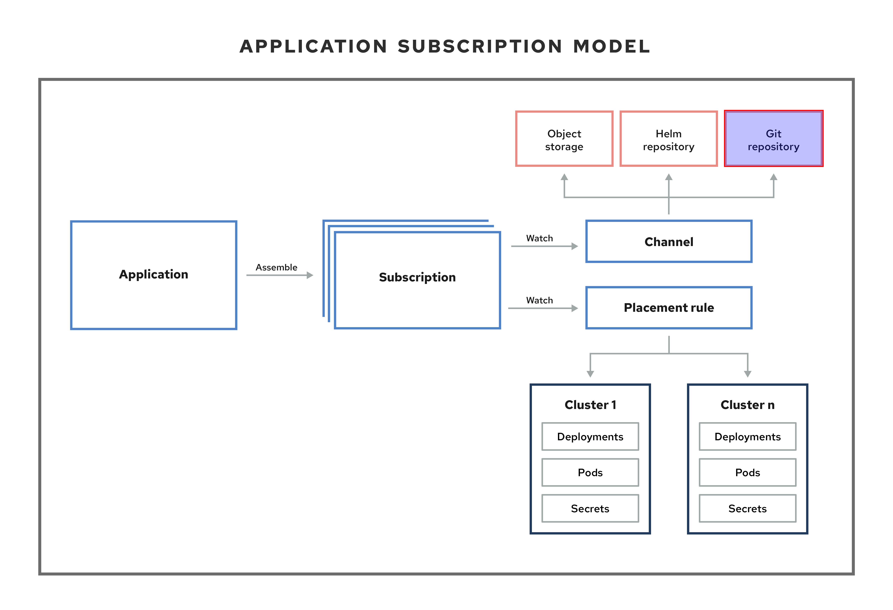

>  **NOTE**: Highlighted our case.

`Subscriptions` (subscription.apps.open-cluster-management.io) allow clusters to subscribe to a source repository (channel) that can be the following types: Git repository, Helm release registry, or Object storage repository.


Subscriptions can point to a channel for identifying new or updated resource templates. The subscription operator can then download directly from the storage location and deploy to targeted managed clusters without checking the hub cluster first. With a subscription, the subscription operator can monitor the channel for new or updated resources instead of the hub cluster (the cluster with the ACM Hub).

Let's start deploying !

>  **User required access**: A user role that can create applications. You can only perform actions that your role is assigned. `cluster-admin` can do it but if you need more granular access review the documentation: [ACM - RBAC](https://access.redhat.com/documentation/en-us/red_hat_advanced_cluster_management_for_kubernetes/2.4/html-single/access_control/index#role-based-access-control)

1. From the ACM web console, `Applications` → `Create application` → `Subscription`

    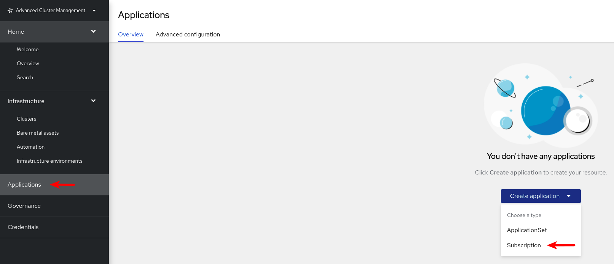

    >  **TIP**: For the following steps, select `YAML: On` to view the YAML in the console as you create your application (or you can import the yaml directly instead of using the interactive web form).

    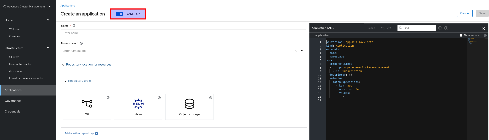

2. Enter the following values in the correct fields:

    - **Name:** pacman-app
    - **Namespace:** pacman

    >  **TIP**: Select a namespace from the list. You can also create a namespace by using a valid Kubernetes name if you are assigned the correct access role.

3. Choose **Git** from the list of repositories that you can use. An example of how it would look like:

    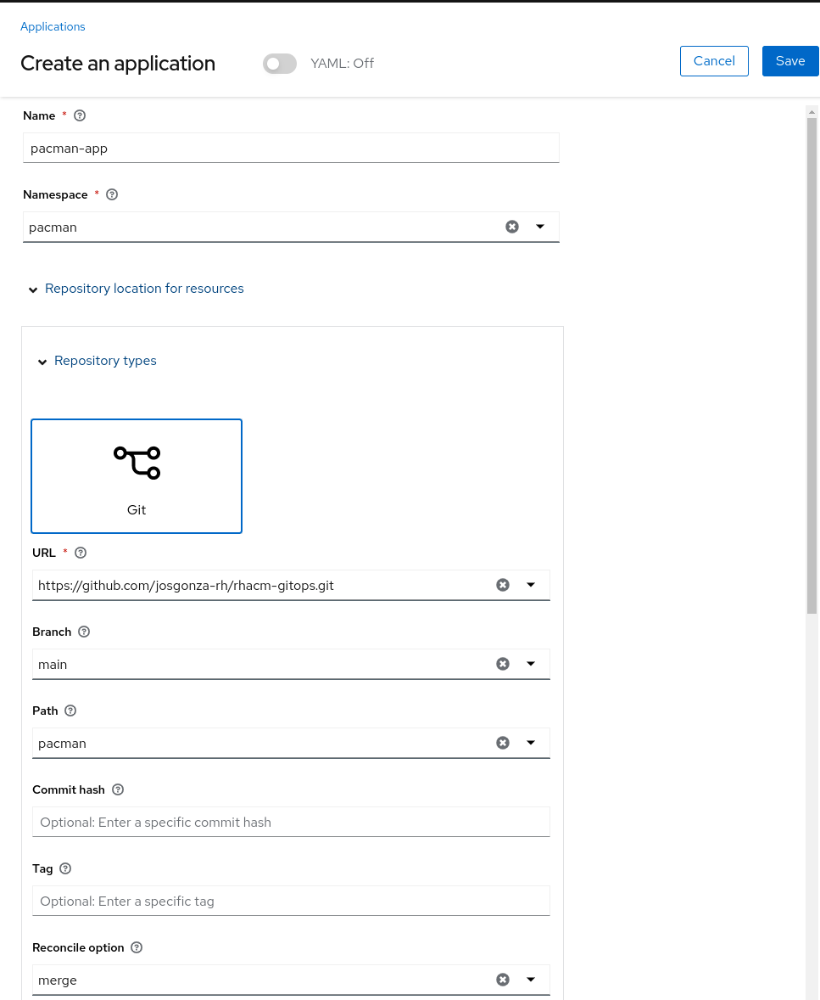
    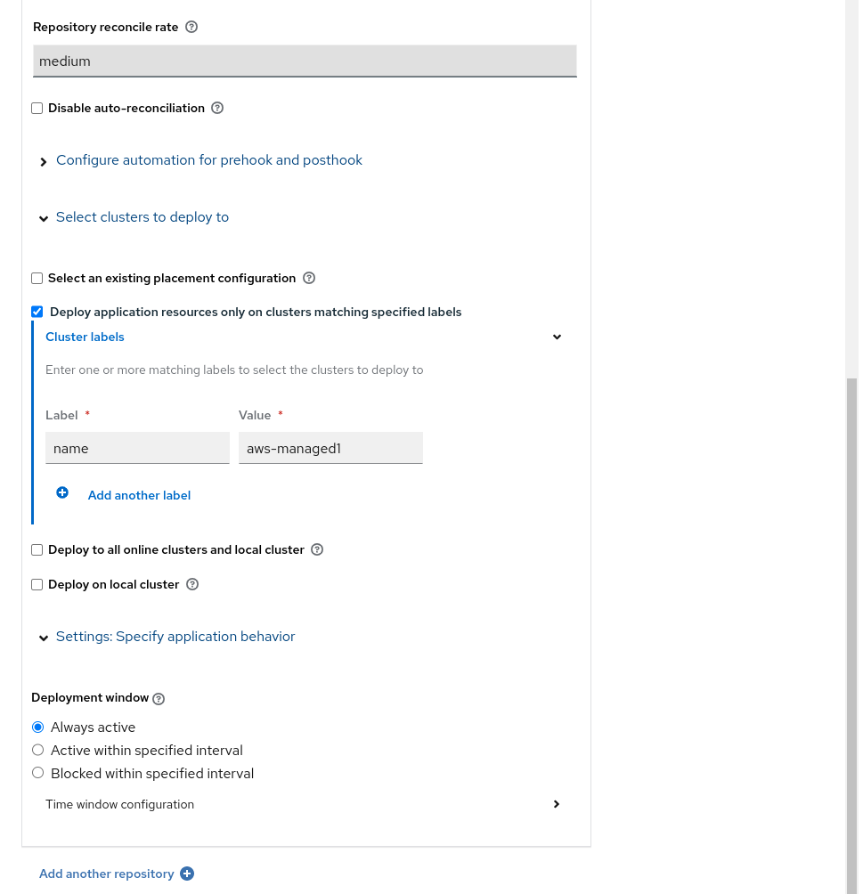

    >  **INFO**: if you want to go deeper with the different options and how they work, please refer to the documentation: [Managing apps with Git repositories](https://access.redhat.com/documentation/en-us/red_hat_advanced_cluster_management_for_kubernetes/2.4/html-single/applications/index#managing-apps-with-git-repositories)

Once you click `Save`, ACM redirects you to the app dashboard, where you can see all the objects that compose the app and if they are correctly deployed.

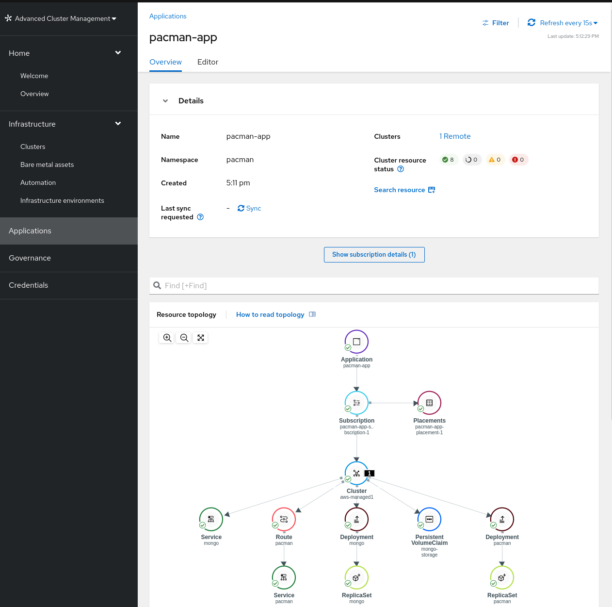

## Deploy ApplicationSets of Argo CD in ACM

`ApplicationSet` is a sub-project of Argo CD that adds multicluster support for Argo CD applications. You can create an `ApplicationSet` from the product console editor, as we will see below.

### Configuring Managed Clusters for Argo CD

Here you have 2 approach:

1. Follow step by step the official documentation: [Configuring Managed Clusters for OpenShift GitOps operator and Argo CD](https://access.redhat.com/documentation/en-us/red_hat_advanced_cluster_management_for_kubernetes/2.4/html-single/applications/index#gitops-config)

2. Install the [policies](rhacm/README.md) within this repo.

    >  **WARNING**: remember to grant your user with the [Subscription Administrator
](https://github.com/open-cluster-management/policy-collection#subscription-administrator) role **before** install them.

If you prefer to continue with the automated approach, once **local-cluster** complies with the policies, add the clusters you want to the **all-openshift-clusters** `ClusterSet` (created by the **policy-openshift-gitops-acm-integration** policy).

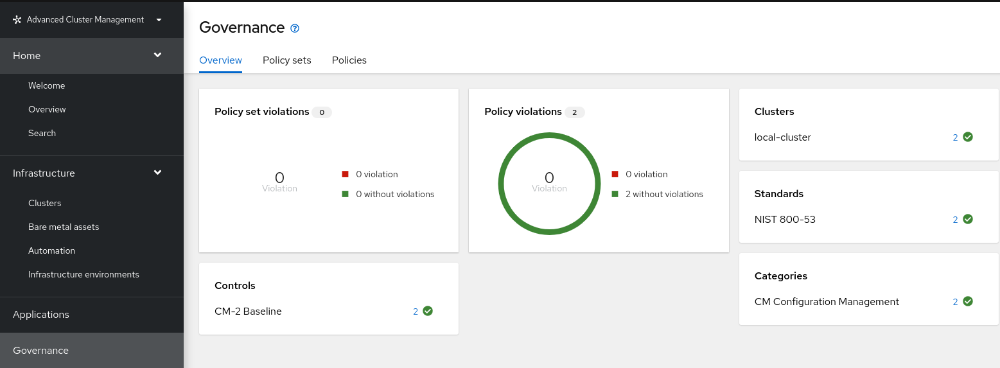

1. `Clusters` → `Cluster sets` → `Manage resource assignments`

    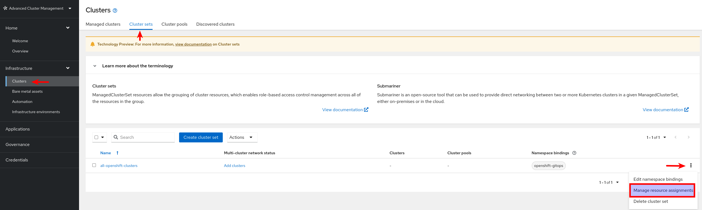

2. In the next screen, just select thec clusters and click on `Review` and then `Save`

    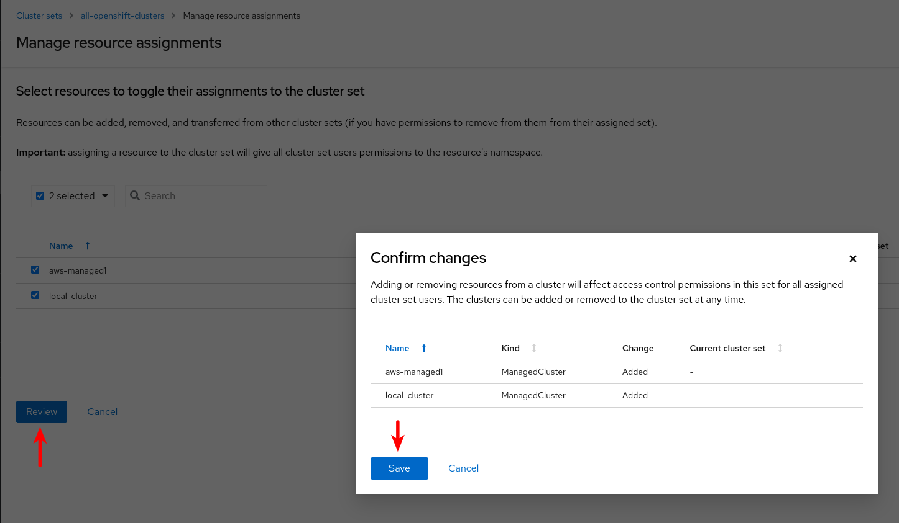

You can check that everything went well in two ways:

1. With the command interface:

    ```bash
    argocd cluster list
    ```

2. By accessing the Argo CD web console. `Settings` → `Clusters`:

    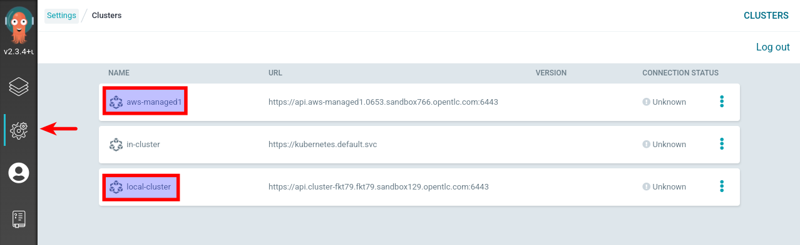

    >  **NOTE**: You can see how the 2 managed clusters (highlighted in the screenshot) have been added to the list of clusters managed by Argo CD.

### Deploying Argo CD ApplicationSets from ACM web console

Once we have the integration between OpenShift GitOps and ACM enabled, we can deploy `ApplicationSet`s with the ACM web console.

Let’s start deploying the ApplicationSet !

1. From the ACM web console, `Applications` → `Create application` → `Argo CD ApplicationSet`

2. Navigate through the different steps in the interactive form on the web console and fill in the relevant data. An example of how it would look like:

    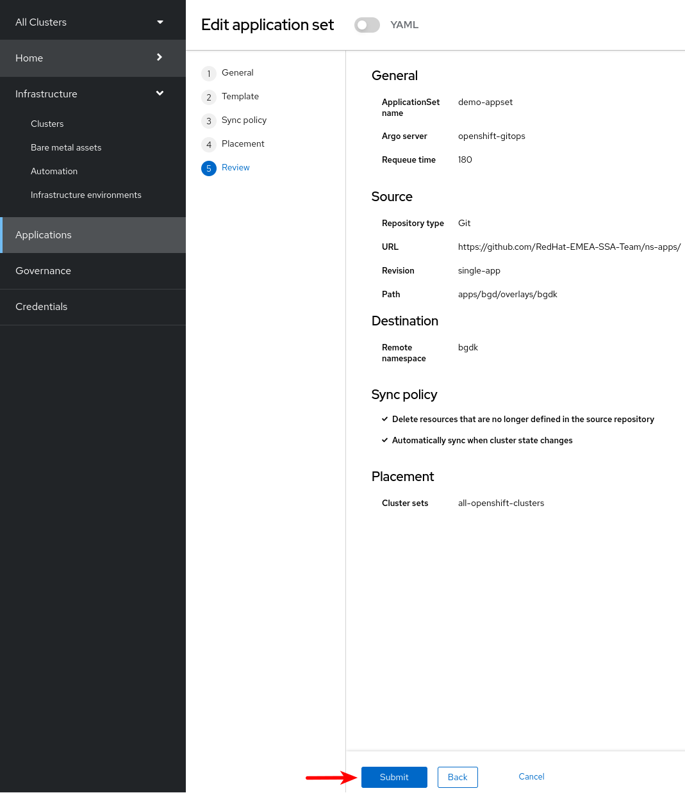

3. After clicking on `Create` you should be presented with the application. To check it, we can go to the applications menu:

    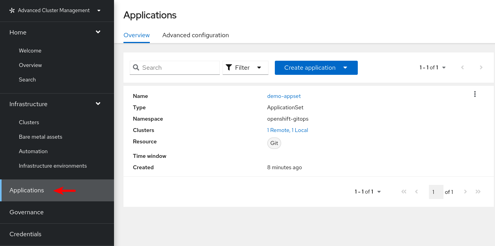

To see its evolution and if all the elements are correctly deployed in both clusters, we can do a drill down by clicking on one of them (the result is the same).

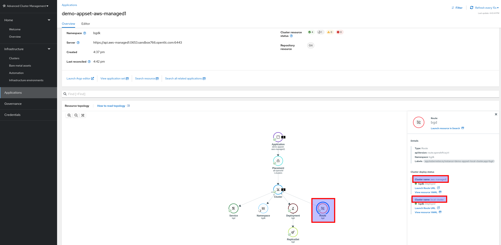

>  **INFO**: In this case we select the `Route` object, checking that it is deployed in both clusters and that we have direct access to the URL or even to be able to edit the `YAML` of the object itself.

You can do the same with the Argo CD web console:

1. General status

    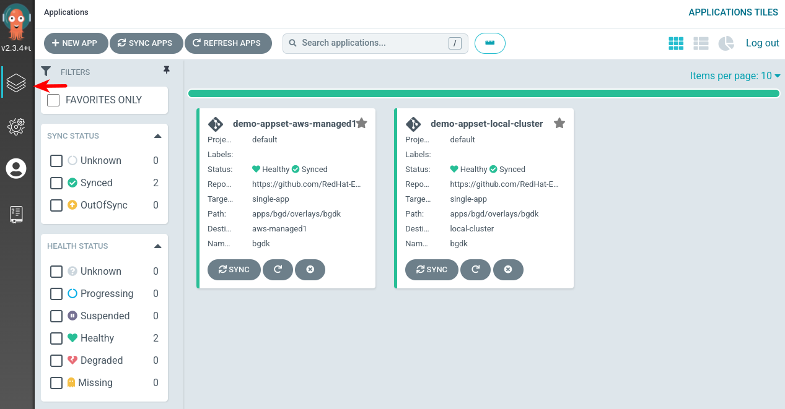

2. Drill down by clicking on one of the instances (one per cluster).

    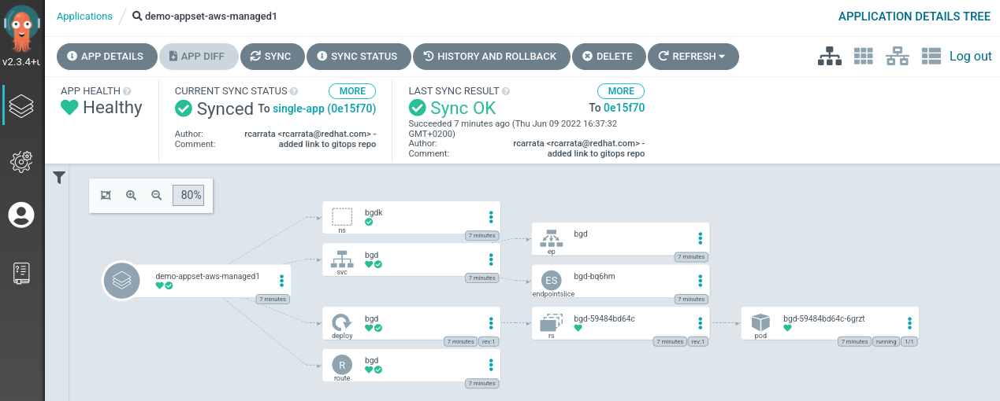

### Deploying with a YAML file

You can do the same as in the previous section using either the web console or the command line.

The content of the `yaml` file should looks like this:

```yaml
apiVersion: argoproj.io/v1alpha1
kind: ApplicationSet
metadata:
  name: acm-appsets
  namespace: openshift-gitops
spec:
  generators:
    - clusterDecisionResource:
        configMapRef: acm-placement
        labelSelector:
          matchLabels:
            cluster.open-cluster-management.io/placement: acm-appset-placement
        requeueAfterSeconds: 180
  template:
    metadata:
      name: 'acm-appset-'
    spec:
      destination:
        namespace: bgdk
        server: ''
      project: default
      source:
        path: apps/bgd/overlays/bgdk
        repoURL: 'https://github.com/RedHat-EMEA-SSA-Team/ns-apps/'
        targetRevision: single-app
      syncPolicy:
        automated:
          prune: true
          selfHeal: true
```

With command line:

```bash
oc apply -f rhacm/deploy/acm-appset.yaml
```

Also using OpenShift web console (`+Add` → `Import YAML`) or `Argo CD` web console (`+NEW APP` → `EDIT AS YAML`) or ACM web console (with the `Create application` menu).
